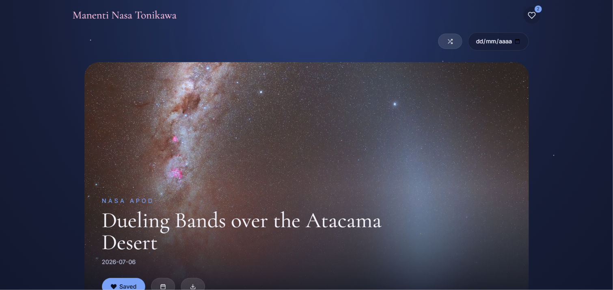

# 🌙 Manenti NASA Tonikawa

A modern web application inspired by the peaceful night skies of *Tonikaku Kawaii* that lets you explore NASA's Astronomy Picture of the Day (APOD).



---

### **[Try Demo Here!](https://manenti-nasa-tonikawa.vercel.app)**

---

# Features

I wanted this to feel like a complete application with its own unique identity, not just a standard API tutorial project. Here is what you can do:

* **Explore the Universe:** View NASA's daily astronomy pictures directly in the app.
* **Time Travel:** Browse past pictures by selecting any available date.
* **Surprise Me:** Hit the randomizer button to discover a completely unexpected astronomy picture.
* **Personal Collection:** Save your favorite APODs locally and access them quickly through a custom sliding drawer.
* **HD Downloads:** Download your favorite starry nights in High Definition (whenever available).
* **Tonikawa UI/UX:** A custom, fully responsive interface inspired by the anime *Tonikaku Kawaii*, featuring smooth page transitions and animations powered by Framer Motion.

---

# How to Run it Locally

To get this project running on your machine, you'll need Node.js installed.

1. **Clone the repository:**
   ```bash
   git clone [https://github.com/noname697/Manenti-Nasa-Tonikawa.git](https://github.com/noname697/Manenti-Nasa-Tonikawa.git)
   cd manenti-nasa-tonikawa
   ```

2. **Install dependencies:**
   ```bash
   npm install
   ```

3. **Set up your environment variables:**
   Create a `.env` file in the root directory and add your free NASA API key (get one at [api.nasa.gov](https://api.nasa.gov/)):
   ```env
   VITE_NASA_API_KEY=YOUR_API_KEY
   ```

4. **Start the development server:**
   ```bash
   npm run dev
   ```

---

# How It Works

The biggest challenge in building this project was keeping the application organized as it grew. I am really proud of transforming a simple API fetcher into a highly modular app.

Instead of dumping all the logic inside React components, I focused on a clean architecture. I separated the APOD API data fetching into custom **Services** and implemented the **Context API** for global state management.

Another interesting hurdle was handling the different media types NASA returns. The app dynamically adapts the UI depending on whether the APOD of the day is a standard image or an embedded video iframe, wrapping everything in smooth **Framer Motion** transitions to keep the peaceful aesthetic intact.

---

# Acknowledgements & Credits

* **NASA** for providing the incredible [APOD API](https://api.nasa.gov/).
* **Hack Club** for organizing the *Give Your Website a Pulse* challenge and pushing me to build this.
* **Kenjiro Hata** and the creators of *Tonikaku Kawaii* for inspiring the visual atmosphere, night skies, and peaceful vibe of this project.

*(Note: This project was designed and developed entirely by me. I used AI as a sounding board for brainstorming, code review, and polishing this documentation, but all architectural decisions, custom styling, and final code integration are my own).*

---

# 📄 License

This project is licensed under the MIT License.